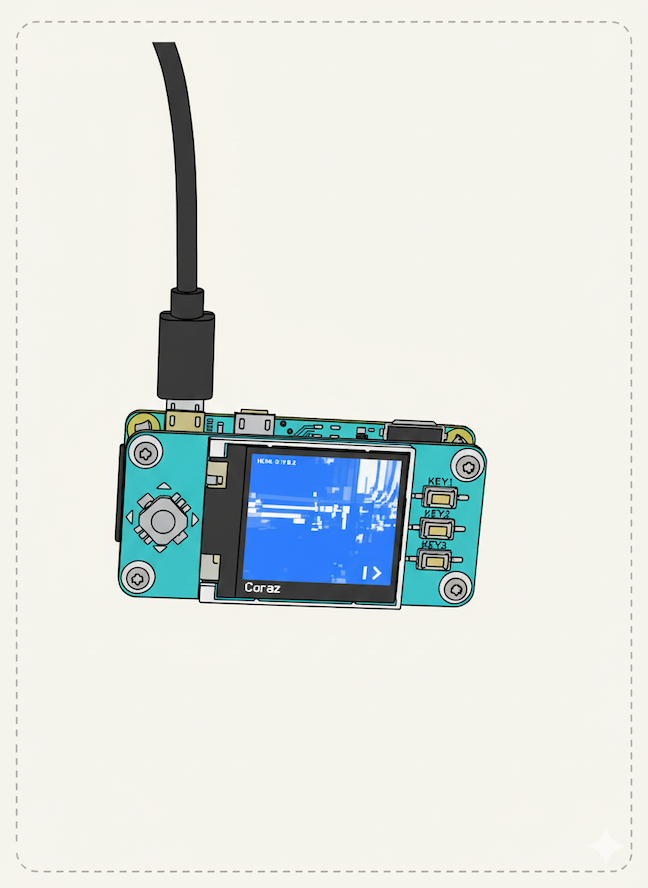

## 💡 RPi Zero 2W Video Doorbell with 1.44' LCD hat

This project outlines a **headless video doorbell solution** designed for the **Raspberry Pi Zero 2W**. It captures existing H.264/H.265 **RTSP streams** from network cameras and displays them on a small **SPI-attached LCD screen**, offering a low-power, simple monitoring interface.

***

### ✨ Features

* **Headless Operation:** Runs without X11 or Wayland, utilizing Python, `opencv-python`, and the **Luma.LCD** library for direct display control.
* **H.26x Stream Decoding:** Captures video feeds from standard **RTSP** sources (H.264/H.265).
* **Stream Cycling:** Uses physical buttons on the HAT for cycling through a configurable list of available video feeds defined in `feeds.json`.
* **Low Footprint:** Designed for the Raspberry Pi Zero 2W's limited resources, prioritizing simplicity and stability over high frame rates.
* **Simple UI:** Features a minimalist display with the current feed's name and navigation indicators.

***

### How to use

* run doorbell.py after raspberry zero boots up
* use key1 and key2 on the LCD hat to cycle feeds

***

### 🛒 Hardware Used

| Component | Product Link | Notes |
| :--- | :--- | :--- |
| **Microcontroller** | [Raspberry Pi Zero 2 W](https://www.raspberrypi.com/products/raspberry-pi-zero-2-w/) | Low-power, small-form-factor board. |
| **Display HAT** | [Waveshare 1.44inch LCD HAT](https://www.waveshare.com/wiki/1.44inch_LCD_HAT) | Uses the **ST7735S** driver and SPI interface. |

| Pin Configuration (BCM) | Pin Number | Function |
| :--- | :--- | :--- |
| **DC** | 25 | Data/Command |
| **RST** | 27 | Reset |
| **Backlight** | 24 | Display Backlight Control |
| **Key 1 (Next)** | 21 | Stream Navigation |
| **Key 2 (Prev)** | 20 | Stream Navigation |
| **Key 3 (Reload)** | 16 | Configuration Reload |
